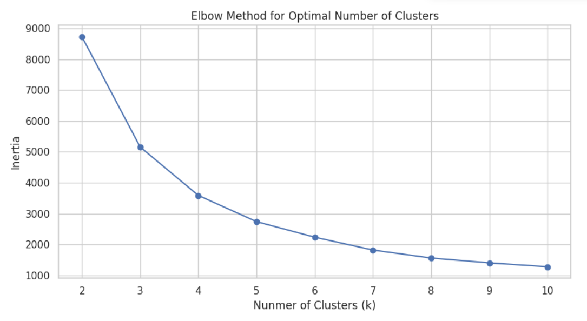
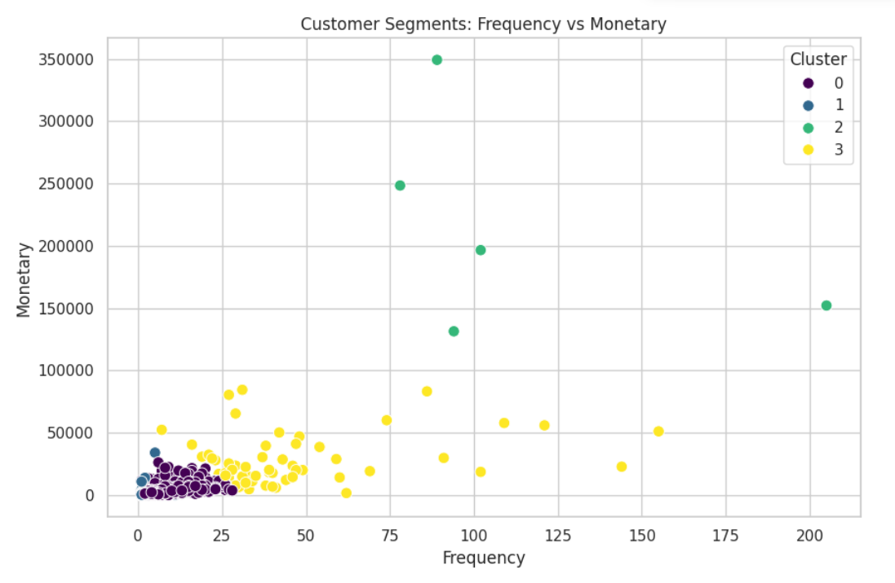
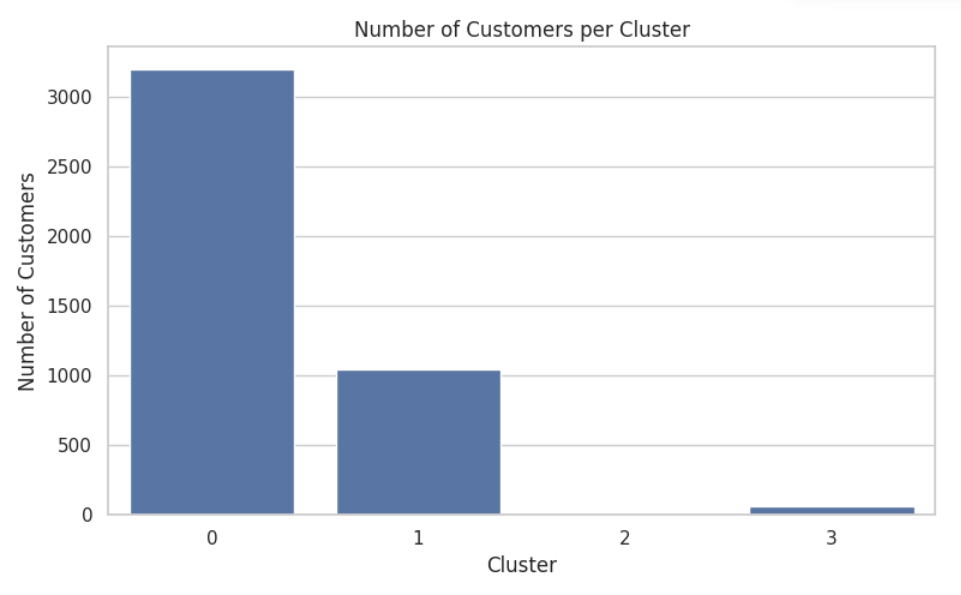

# Task 2 - Customer Segmentation

## Overview

This project was completed as part of the Oasis Infobyte Data Analytics Internship.

The project focuses on customer segmentation using data analysis and clustering techniques to identify groups of customers with similar characteristics and purchasing behaviour.

## Tools and Technologies

- Python
- Pandas
- NumPy
- Matplotlib
- Seaborn
- Scikit-learn
- Google Colab
- Jupyter Notebook

## Project Objectives

- Explore and prepare customer data
- Perform data analysis and visualization
- Identify meaningful customer segments
- Apply clustering techniques
- Visualize and interpret the resulting customer groups

## Project Files

- `Task2_Customer_Segmentation.ipynb` - Complete analysis notebook
- `README.md` - Project documentation

  ## Results

### Elbow Method

### Customer Segmentation

### Cluster Analysis

